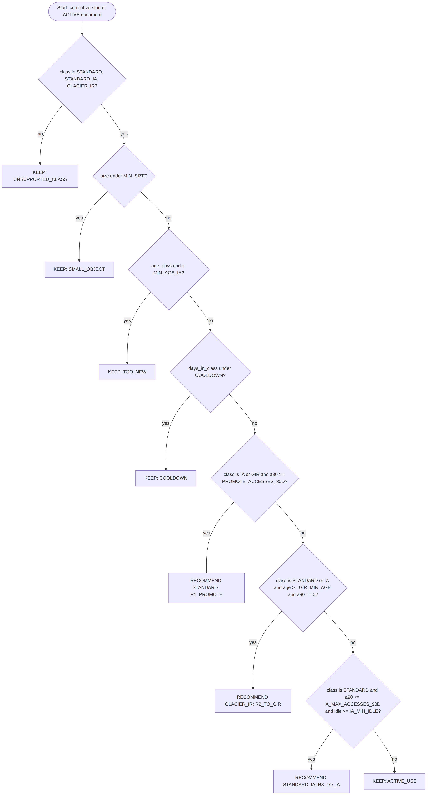

# 7. Intelligent Storage Optimization (Recommendation Engine)

> **This is CloudVault's heuristic. It is not an AWS algorithm and it is not S3 Intelligent-Tiering.**
> The UI, README and demo MUST say so. CloudVault analyzes application-level access history and recommends a storage class.

## 7.1 Inputs (per current version of an `ACTIVE` document)

| Input | Source |
|---|---|
| `size_bytes` | `document_versions.size_bytes` |
| `storage_class` | `document_versions.storage_class` |
| `age_days` | now minus `document_versions.created_at` |
| `days_in_class` | now minus `storage_class_changed_at` |
| `a30`, `a90` | count of `access_logs` for the version in the last 30/90 days |
| `idle_days` | days since the later of last access and `created_at` |

**Access-history limitation.** S3 does not expose an application-friendly last-accessed timestamp for every object. CloudVault records an `access_logs` row each time it issues a presigned download URL. Use of a leaked URL elsewhere is not counted.

## 7.2 Thresholds (configurable via env, shown in UI)

| Name | Default | Env var | Rationale |
|---|---|---|---|
| `MIN_SIZE` | 131072 (128 KiB) | `REC_MIN_SIZE` | IA/GIR classes bill a minimum object size, so small files gain nothing (`VERIFY`) |
| `MIN_AGE_IA` | 30 days | `REC_MIN_AGE_IA_DAYS` | STANDARD_IA has a 30-day minimum storage duration (`VERIFY`) |
| `IA_MAX_ACCESSES_90D` | 2 | `REC_IA_MAX_ACCESSES_90D` | Definition of "rarely accessed" |
| `IA_MIN_IDLE` | 30 days | (constant = `MIN_AGE_IA`) | Avoid moving recently used files |
| `GIR_MIN_AGE` | 90 days | `REC_GIR_MIN_AGE_DAYS` | GLACIER_IR has a 90-day minimum storage duration (`VERIFY`) |
| `PROMOTE_ACCESSES_30D` | 3 | `REC_PROMOTE_ACCESSES_30D` | Frequent retrieval makes IA/GIR retrieval charges likely to outweigh storage savings |
| `COOLDOWN` | 30 days | `REC_COOLDOWN_DAYS` | Prevent flapping between classes |

These are heuristics for a student project; they are **not claimed to be optimal**.

## 7.3 Edge cases

| Case | Behavior |
|---|---|
| Recently uploaded (age under 30 days) | KEEP, reason `TOO_NEW` |
| Small file | KEEP, `SMALL_OBJECT` |
| Deleted document | Not evaluated |
| Noncurrent versions | Not evaluated (only the current version is eligible because apply replaces it) |
| Unsupported class (anything other than STANDARD, STANDARD_IA, GLACIER_IR) | KEEP, `UNSUPPORTED_CLASS` |
| Class changed recently | KEEP, `COOLDOWN` |
| Conflicting signals | Strict rule priority R1, R2, R3; first match wins |
| `state=S3_MISSING` version | Not evaluated |

## 7.4 Algorithm (pure function, `now` injected)

```text
function evaluate(v, now, cfg) -> Result(kind, target, rule_id, reason, signals)

  signals = {
    size: v.size_bytes, cls: v.storage_class,
    age_days: days(now - v.created_at),
    days_in_class: days(now - v.storage_class_changed_at),
    a30: count(access_logs where version=v and accessed_at >= now-30d),
    a90: count(access_logs where version=v and accessed_at >= now-90d),
    idle_days: days(now - max(last_access(v) or v.created_at, v.created_at))
  }

  if v.cls not in {STANDARD, STANDARD_IA, GLACIER_IR}:  return KEEP("UNSUPPORTED_CLASS")
  if v.size < cfg.MIN_SIZE:                              return KEEP("SMALL_OBJECT")
  if signals.age_days < cfg.MIN_AGE_IA:                  return KEEP("TOO_NEW")
  if signals.days_in_class < cfg.COOLDOWN:               return KEEP("COOLDOWN")

  # R1: promote hot data out of cold classes
  if v.cls in {STANDARD_IA, GLACIER_IR} and signals.a30 >= cfg.PROMOTE_ACCESSES_30D:
      return RECOMMEND(STANDARD, "R1_PROMOTE",
        "Accessed {a30} times in 30 days; retrieval charges likely outweigh storage savings")

  # R2: very cold data to Glacier Instant Retrieval
  if v.cls in {STANDARD, STANDARD_IA} and signals.age_days >= cfg.GIR_MIN_AGE
      and signals.a90 == 0:
      return RECOMMEND(GLACIER_IR, "R2_TO_GIR", "Not accessed in 90 days and older than 90 days")

  # R3: rarely accessed data to Standard-IA
  if v.cls == STANDARD and signals.a90 <= cfg.IA_MAX_ACCESSES_90D
      and signals.idle_days >= cfg.IA_MIN_IDLE:
      return RECOMMEND(STANDARD_IA, "R3_TO_IA",
        "Low access frequency ({a90} in 90 days), idle {idle_days} days")

  return KEEP("ACTIVE_USE")
```



**Properties (must hold):** deterministic; pure (no I/O inside `evaluate`; the access counts are passed in or loaded by the caller); explainable (reason text is built from signals); testable (tests in doc 10 U1 to U8); no machine learning.

**Evaluation order matters:** the four KEEP guards run first, then R1, R2, R3. Note R2 is checked before R3, so a file that qualifies for both gets GLACIER_IR.

## 7.5 Cost estimates (optional, Tier 3)

- **Never** display invented percentages or monetary savings.
- If `pricing.json` exists (filled by the developer from the official AWS S3 pricing page for the chosen region, containing `region`, `verified_on`, `source_url` and per-GB-month storage prices per class), the UI shows: *"Storage-only estimate ≈ size_GB × (price_current − price_target) per month; excludes retrieval, requests, minimum duration and data transfer."*
- If the file is missing, show only the qualitative impact. `estimate` in the API is `null`.

## 7.6 Apply flow (summary)
Lock document, re-evaluate, 409 `STALE_RECOMMENDATION` on mismatch, `CopyObject` to the same key with the new StorageClass (source = current VersionId), update DB, mark `APPLIED`, commit, then delete the old S3 version. See diagram `06-apply-recommendation-sequence` (doc 03, W11).

## 7.7 Demo data caveat
Real uploads are never 30+ days old at demo time, so `scripts/seed_demo.py` uploads real files to real S3 and **backdates `created_at` and access-log rows in the database only**. S3's own `LastModified` stays real. The demo and README MUST disclose this.
