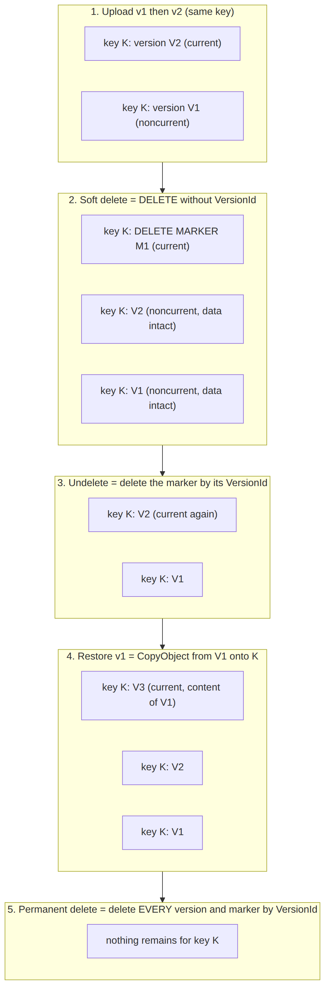

# 2. S3 Design

> **Amended:** AM-7: this chapter describes the S3 behaviors CloudVault simulates in PostgreSQL. There is no real bucket, IAM or `setup_s3.py`; bucket settings are fixed simulation rules. Do not create the bucket, policy, notification or lifecycle configuration described below in AWS. See [doc 15](15-amendments.md).

Labels: `[AWS]` real feature, `[APP]` our logic, `[UI]` representation.

## 2.1 S3 capability matrix

| Capability | Real AWS? | Used? | How CloudVault uses it / why not |
|---|---|---|---|
| Bucket | Yes | Yes | One private bucket per environment in `ap-south-1` |
| Object | Yes | Yes | One S3 key per document; each upload creates a new S3 object version |
| Object key | Yes | Yes | Opaque UUID path (section 2.3) |
| System metadata | Yes | Yes | `Content-Type`, `ContentLength`, `ETag`, `LastModified` shown in Inspector |
| User-defined metadata (`x-amz-meta-*`) | Yes | Yes | ASCII-only `cv-doc-id`, `cv-owner-id`. Cannot be edited after upload; changing needs a copy |
| Object tags | Yes | Yes | `project=cloudvault`, `env=<env>` for cost tracking and cleanup. No user data in tags |
| Versioning | Yes | Yes | Enabled at setup. Once enabled it can only be suspended, never turned off |
| Delete markers | Yes | Yes | Soft delete creates one; undelete removes it |
| Presigned URLs | Yes | Yes | GET only, 120 s expiry, bound to a VersionId |
| Storage classes | Yes | Yes | STANDARD, STANDARD_IA, GLACIER_IR only |
| Intelligent-Tiering | Yes | **No** | It is AWS's own automatic tiering with a per-object monitoring charge. Our heuristic is separate and says so |
| Lifecycle rules | Yes | Yes (small) | Noncurrent-version expiry, abort incomplete multipart, expired delete-marker cleanup. Not used for tiering because tiering here is per-object and driven by our access log |
| Event notifications | Yes | Yes | `s3:ObjectCreated:Put` to Lambda. Delivery is at-least-once, so Lambda is idempotent |
| IAM | Yes | Yes | Least-privilege backend user and Lambda role |
| Block Public Access | Yes | Yes | All four settings on |
| SSE-S3 encryption | Yes | Yes | Default encryption (`VERIFY` default behavior on new buckets) |
| SSE-KMS | Yes | **No** | Extra cost and key-policy complexity, no assignment value |
| CORS | Yes | **No** | Uploads are proxied; downloads are plain navigation to the presigned URL, so the browser never makes a cross-origin fetch to S3. Deliberate choice |
| Multipart upload | Yes | **No** | Needed for large files only. The 10 MiB cap makes single PUT sufficient. The lifecycle abort rule is a safety net |
| Object Lock | Yes | **No** | Irreversibility risk and scope creep |
| Additional checksums (SHA-256) | Yes | Yes | Backend sends SHA-256 on PUT; S3 verifies it (`VERIFY` boto3 parameter names) |
| Server access logs / CloudTrail data events | Yes | **No** | Delayed/best-effort or extra cost. We use an application access log |
| Storage Lens / Storage Class Analysis | Yes | **No** | Real AWS analytics tools. Ours is separate and says so |

## 2.2 Bucket configuration

| Item | Decision | Reason |
|---|---|---|
| Name | `cloudvault-{env}-{6 random lowercase alphanumerics}` | Bucket names are globally unique |
| Region | `ap-south-1` | Close to the developer; pricing differs by region (`VERIFY`) |
| Versioning | Enabled by `infrastructure/setup_s3.py` | Required for version history, soft delete, restore |
| Block Public Access | All 4 settings ON | Private by default |
| Bucket policy | Deny requests where `aws:SecureTransport` is false | TLS only |
| Default encryption | SSE-S3 (`VERIFY`) | Free, no key management |
| CORS | **Not configured** | See matrix |
| Metadata on objects | `cv-doc-id`, `cv-owner-id` (ASCII), `Content-Type` | Immutable without a copy; keep minimal |
| Tags on objects | `project=cloudvault`, `env=<env>` | Cost tracking/cleanup |
| Lifecycle | (1) abort incomplete multipart after 1 day; (2) expire noncurrent versions after 90 days; (3) remove expired delete markers | Caps version cost. `VERIFY` whether rules 2 and 3 can share one rule |
| Notification | `s3:ObjectCreated:Put`, prefix `documents/`, destination Lambda `cloudvault-processor` | `Copy` events (restore, tier change) deliberately not subscribed |

**Consequence of lifecycle rule (2):** old versions can disappear from S3 after 90 days while the DB still lists them. The app MUST handle this: HTTP 410 `VERSION_EXPIRED` and mark the version `S3_MISSING`.

## 2.3 Object key strategy

**Chosen format:** `documents/{owner_uuid}/{document_uuid}`

| Concern | Handling |
|---|---|
| Filename collisions | None (UUID keys) |
| Renaming | Changes only DB `display_name`; no S3 copy |
| Unicode, long names, path traversal | Filename never appears in the key or on local disk |
| Enumeration/privacy | Random UUIDs; filename leaks nowhere in S3 |
| Versioning | One key per document; S3 versions are the file's versions |
| DB references | `documents.s3_key` plus `document_versions.s3_version_id` |
| Per-user IAM prefix | Owner segment permits future prefix scoping |
| Content type | Stored as the object's `Content-Type`; no file extension in key |

**Rejected:** `users/{id}/{filename}` because it is user-controlled, collides on re-upload, and exposes filenames.

## 2.4 S3 behaviors baked into the design (VERIFY items flagged)

1. `[AWS]` `CopyObject` onto the same key in a versioned bucket creates a **new version**. `VERIFY`
2. The old version stays stored and billed until deleted. Therefore "apply recommendation" **deletes the old version after the copy**.
3. `HeadObject` does not return a storage class for STANDARD objects. The Inspector MUST display "STANDARD" when the field is absent. `VERIFY`
4. A plain `DeleteObject` (no VersionId) on a versioned bucket creates a delete marker and returns its VersionId. Data remains.
5. `DeleteObject` with a VersionId permanently removes exactly that version or marker.
6. Deleting the current delete marker by its VersionId makes the latest remaining version current again (this is how undelete works).
7. A presigned URL carries the permissions of the credentials that signed it, so the backend IAM user needs `s3:GetObjectVersion` for version-bound URLs.
8. Presigned URL generation is local signing (no S3 request is made).
9. Everything that looks like a folder in S3 is just a key prefix.

See also: [`diagrams/04-versioning-and-delete.png`](diagrams/04-versioning-and-delete.png)

## 2.5 Delete semantics (exact definitions)

| Term | Definition in CloudVault |
|---|---|
| Normal (soft) delete | `DeleteObject` without VersionId: S3 adds a delete marker; DB `status=DELETED`; marker VersionId stored in `documents.delete_marker_version_id`; no data removed |
| Delete marker | Placeholder current version that makes the key appear deleted |
| Historical versions | All prior S3 versions, retained and billed until expired or permanently deleted |
| Undelete | Delete the stored marker by its VersionId; DB `status=ACTIVE` |
| Permanent delete | Allowed only when `status=DELETED`. List all versions and delete markers for the key and delete each by VersionId; only after S3 reports success, delete DB rows. On partial failure return 502 and keep the document `DELETED` so the call can be repeated safely |
| Restore | `CopyObject` from an old VersionId onto the same key, producing a **new** current version (old versions untouched). Allowed only when `status=ACTIVE` |
