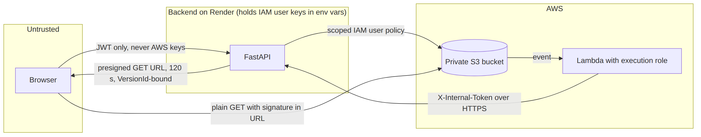
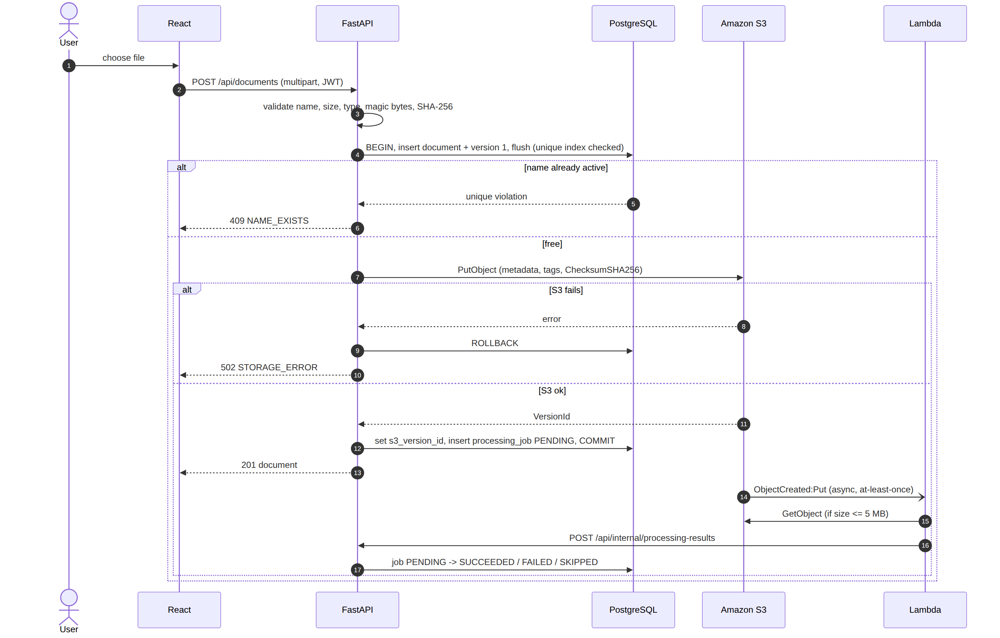

# 3. Architecture and Workflows

> **Amended:** AM-7: S3 calls go to the simulated `ObjectStorage`; Lambda is replaced by the durable `processing_jobs` queue and an in-process worker; presigned URLs are HMAC-signed links to the app's own route. Diagrams still show the original AWS design. See [doc 15](15-amendments.md).

## 3.1 Logical architecture

Source: [`diagrams/01-logical-architecture.mmd`](diagrams/01-logical-architecture.mmd)

## 3.2 Deployment architecture

Source: [`diagrams/02-deployment-architecture.mmd`](diagrams/02-deployment-architecture.mmd)

**External request flow:** Browser to Vercel (static files) to Render API (JWT) to Neon and S3 (IAM user keys in Render env vars). Browser to S3 happens **only** through a short-lived presigned GET URL.

## 3.3 Trust boundaries

## 3.4 Feature classification

| Feature | Class |
|---|---|
| Versions, delete markers, presigned URLs, storage class, tags, event notifications | `[AWS]` |
| Version numbers, trash view, access log, recommendations, dashboard, duplicate detection | `[APP]` |
| Bucket-style file table and S3 Inspector panel | `[UI]` |

## 3.5 Conventions for all workflows

> **Amended:** AM-1: no application transaction is held across a storage call; per-document advisory locks serialize writes. See [doc 15](15-amendments.md).

- Every mutating call on one document takes a Postgres row lock: `SELECT ... FOR UPDATE` on the `documents` row.
- Errors use `{"error":{"code","message","details"}}` (see doc 05).
- "Failure" below lists the main outcomes; the complete table is in doc 09.
- DB changes for uploads commit only after S3 succeeds (see doc 09 section 9.3).

## 3.6 Workflows

### W1. User opens application
- **Actor:** User. **Request:** `GET /api/auth/me`, then `GET /api/dashboard/summary`.
- **Backend:** verify JWT, aggregate. **AWS:** none. **DB:** read.
- **Success:** 200. **Failure:** 401, redirect to login.

### W2. Upload file (new document)

> **Amended:** AM-1 and AM-9: transaction 1 flushes and commits only the `PENDING` document (name reserved), the store write runs with no transaction open, and transaction 2 inserts v1 with the returned `s3_version_id`. See [doc 15](15-amendments.md).
- **Actor:** User. **Request:** `POST /api/documents` (multipart).
- **Backend:** validate (doc 05 section 5.3); read at most 10 MiB into memory; compute SHA-256; open transaction; insert `documents` and `document_versions` (v1) and `flush()` so the partial unique index fires **before** S3; `PutObject`; set `s3_version_id`; insert `processing_jobs(PENDING)`; commit.
- **AWS:** `PutObject` (versioned; metadata, tags, SHA-256 checksum) returns VersionId. **DB:** rows exist only after commit.
- **Success:** 201 document JSON.
- **Failure:** 400/413/415/422 validation; 409 `NAME_EXISTS`; 502 S3 error (transaction rolled back, nothing stored). If the commit fails after the PUT, delete that exact S3 version (best effort).

### W3. Download file

> **Amended:** AM-4 and AM-7: no storage call here; the link is an HMAC-signed app URL; 410 comes from the database `state`. See [doc 15](15-amendments.md).
- **Request:** `GET /api/documents/{id}/download?version=n` (default: current).
- **Backend:** check owner and `status=ACTIVE`; presign GET with VersionId and `ResponseContentDisposition=attachment; filename*=UTF-8''<encoded display_name>`; insert `access_logs` row.
- **AWS:** `generate_presigned_url` (local signing, no S3 call). **DB:** `access_logs` +1.
- **Success:** 200 `{url, expires_in}`. **Failure:** 404, 409 `DOCUMENT_DELETED`, 410 `VERSION_EXPIRED`. If the log insert fails, the download is refused (fail closed).

### W4. Delete file (soft)

> **Amended:** AM-1: the store call runs outside the transaction, under the document's advisory lock, recorded by `pending_op='DELETE'`. See [doc 15](15-amendments.md).
- **Request:** `DELETE /api/documents/{id}`.
- **Backend:** lock row; `DeleteObject` **without** VersionId; set `status=DELETED`, `deleted_at`, `delete_marker_version_id`.
- **AWS:** delete marker created, no data removed. **DB:** status updated.
- **Success:** 204 (idempotent if already deleted). **Failure:** 502 then rollback.

### W5. Upload new version

> **Amended:** AM-1 and AM-9: under the document lock, the store write runs first with no transaction open; the version row is inserted afterwards with its `s3_version_id`. See [doc 15](15-amendments.md).
- **Request:** `POST /api/documents/{id}/versions` (multipart).
- **Backend:** same as W2 under the document lock; `version_number = max+1`; if SHA-256 equals the current version return 200 `{duplicate:true}` and create nothing.
- **AWS:** `PutObject` on the same key returns a new VersionId. **DB:** new version row + processing job; `current_version_id` updated.
- **Success:** 201. **Failure:** 404, 409 `DOCUMENT_DELETED`, 413, 415, 502.

### W6. Restore version

> **Amended:** AM-1, AM-2 and AM-9: the restored version gets its own new `PENDING` job (the source job is not copied) and its row is inserted only after the copy succeeded. See [doc 15](15-amendments.md).
- **Request:** `POST /api/documents/{id}/versions/{n}/restore`.
- **Backend:** lock; verify `ACTIVE` and source version `state=ACTIVE`; `CopyObject` from the old VersionId onto the same key; insert version row with `origin=RESTORE`, `restored_from_version=n`; copy the extraction fields from the source job if it succeeded (so no reprocessing is needed; Copy events are not subscribed).
- **AWS:** `CopyObject` creates a new current version; old versions untouched.
- **Success:** 201. **Failure:** 404 version, 410 expired, 409 deleted, 502.

### W7. Search
- **Request:** `GET /api/documents?q=&type=&storage_class=&status=&sort=&page=&page_size=`.
- **Backend:** SQL `ILIKE` on `display_name` and the current version's processing `text_excerpt`; always scoped by `owner_id`; paginated. **AWS:** none.
- **Success:** 200. **Failure:** 422 on bad params.

### W8. View metadata
- **Request:** `GET /api/documents/{id}` (DB fields) and `GET /api/documents/{id}/s3-info` (live).
- **AWS:** `HeadObject` and `GetObjectTagging` for the selected VersionId.
- **Success:** 200. **Failure:** 502 for the live call (DB data from `/documents/{id}` still returns).

### W9. Record access
- Happens inside W3. Event type `DOWNLOAD`, logged **when the presigned URL is issued**. S3 does not report it back; a leaked URL used elsewhere is not counted.

### W10. Generate storage recommendation
- **Request:** `POST /api/recommendations/refresh`.
- **Backend:** run the engine (doc 07) over the user's current versions of `ACTIVE` documents; mark previous `OPEN` rows `STALE`; insert new `OPEN` rows for each recommendation. **AWS:** none.
- **Success:** 200 list.

### W11. Apply storage recommendation

> **Amended:** AM-1 and AM-7: Apply runs in full against the simulated store; the copy runs outside the transaction. See [doc 15](15-amendments.md).
- **Request:** `POST /api/recommendations/{id}/apply`.
- **Backend:** lock document; re-run engine; if the result differs from the stored recommendation return 409 `STALE_RECOMMENDATION` (mark `STALE`); `CopyObject` onto the same key with the target `StorageClass`; update the version row (`s3_version_id`, `storage_class`, `storage_class_changed_at`); mark `APPLIED`; commit; then `DeleteObject` with the **old** VersionId (best effort; reconcile cleans leftovers).
- **Success:** 200. **Failure:** 409 stale, 502 S3.

### W12. S3 event processing

> **Amended:** AM-7: replaced by the durable `processing_jobs` queue and in-process worker. See [doc 15](15-amendments.md).
- S3 sends `ObjectCreated:Put` (prefix `documents/`) to Lambda asynchronously. Delivery is at-least-once.

### W13. Lambda processing
- Lambda decodes the key (`unquote_plus`), skips objects over 5 MB, downloads the object, extracts, then `POST /api/internal/processing-results`. See doc 08.

### W14. Failed upload
- Validation failure: no state changed. S3 failure: DB rolled back, nothing stored. Commit failure after a successful PUT: compensating delete of that S3 version; if that also fails, reconcile detects it.

### W15. Failed processing
- Deterministic failures (unsupported, too large, corrupt): reported as `SKIPPED` or `FAILED`; Lambda returns success. Transient failures (callback 5xx, 404, 409, network): Lambda raises so the platform retries (`VERIFY` async retry behavior). If retries are exhausted the job stays `PENDING`; the UI shows "Stalled" after 10 minutes.

### W16. Retry

> **Amended:** AM-7: retry resets the job to `PENDING` (`attempts+1`, `deliveries=0`); the worker picks it up. See [doc 15](15-amendments.md).
- **Request:** `POST /api/documents/{id}/processing/retry?version=n` (Tier 3 feature).
- **Backend:** allowed if the job is `FAILED` or stalled `PENDING`; set `PENDING`, `attempts+1`; invoke Lambda asynchronously with a synthetic S3-shaped event.
- **Success:** 202. **Failure:** 409 if `SUCCEEDED`/`SKIPPED`, 502.
