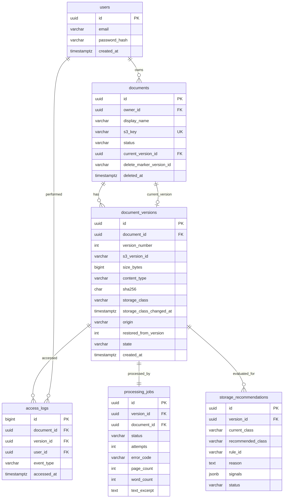
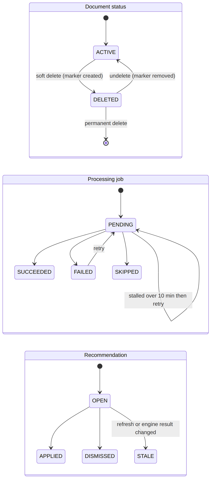

# 4. Database Design

> **Amended:** AM-1, AM-4, AM-7 and AM-9: extra document status values, `pending_op` columns, NOT NULL foreign keys, integrity checks, `processing_jobs.claimed_at`/`deliveries`, and the simulated-store table `sim_object_versions`. `document_versions.s3_version_id` stays NOT NULL and version `state` stays `ACTIVE`/`S3_MISSING` as below (AM-9). See [doc 15](15-amendments.md).

PostgreSQL 15+, SQLAlchemy 2.x, Alembic. All timestamps are `timestamptz` in UTC. IDs are UUID v4 unless noted. Only the six tables below exist.

Source: [`diagrams/09-er-diagram.mmd`](diagrams/09-er-diagram.mmd)

## users
| Column | Type | Notes |
|---|---|---|
| id | uuid PK | |
| email | varchar(254) | NOT NULL; unique index on `lower(email)` |
| password_hash | varchar(255) | NOT NULL (bcrypt) |
| created_at | timestamptz | default `now()` |

## documents
| Column | Type | Notes |
|---|---|---|
| id | uuid PK | |
| owner_id | uuid FK to users | NOT NULL, indexed |
| display_name | varchar(255) | NOT NULL, sanitized |
| s3_key | varchar(200) | NOT NULL, UNIQUE |
| status | varchar(10) | `ACTIVE` or `DELETED`, default `ACTIVE`, CHECK |
| current_version_id | uuid FK to document_versions | nullable (circular FK; use `use_alter=True`) |
| delete_marker_version_id | varchar(64) | nullable; S3 VersionId of the marker |
| deleted_at | timestamptz | nullable |
| created_at, updated_at | timestamptz | default `now()` |

- **Partial unique index:** `(owner_id, lower(display_name)) WHERE status='ACTIVE'`
- Index `(owner_id, status)`

## document_versions
| Column | Type | Notes |
|---|---|---|
| id | uuid PK | |
| document_id | uuid FK ON DELETE CASCADE | NOT NULL |
| version_number | int | NOT NULL, starts at 1 |
| s3_version_id | varchar(64) | NOT NULL after commit |
| size_bytes | bigint | NOT NULL, CHECK > 0 |
| content_type | varchar(100) | NOT NULL |
| sha256 | char(64) | NOT NULL |
| storage_class | varchar(20) | default `STANDARD` |
| storage_class_changed_at | timestamptz | default = `created_at` |
| origin | varchar(10) | `UPLOAD` or `RESTORE` |
| restored_from_version | int | nullable |
| state | varchar(12) | `ACTIVE` or `S3_MISSING`, default `ACTIVE` |
| created_at | timestamptz | default `now()` (seed script may backdate) |

- Unique `(document_id, version_number)`; unique `(document_id, s3_version_id)`; index `(document_id, created_at)`.

## access_logs
| Column | Type | Notes |
|---|---|---|
| id | bigserial PK | |
| document_id | uuid FK ON DELETE CASCADE | |
| version_id | uuid FK to document_versions ON DELETE CASCADE | |
| user_id | uuid FK to users | |
| event_type | varchar(12) | default `DOWNLOAD` |
| accessed_at | timestamptz | default `now()` |

- Index `(version_id, accessed_at DESC)`.

## processing_jobs
| Column | Type | Notes |
|---|---|---|
| id | uuid PK | |
| version_id | uuid FK ON DELETE CASCADE | **UNIQUE** (idempotency anchor) |
| document_id | uuid FK | indexed |
| status | varchar(10) | `PENDING`, `SUCCEEDED`, `FAILED`, `SKIPPED` |
| attempts | int | default 0 |
| error_code | varchar(40) | nullable |
| error_message | varchar(500) | nullable |
| page_count, word_count | int | nullable |
| text_excerpt | text | nullable, at most 4000 chars |
| created_at, finished_at | timestamptz | `finished_at` nullable |

## storage_recommendations
| Column | Type | Notes |
|---|---|---|
| id | uuid PK | |
| version_id | uuid FK ON DELETE CASCADE | |
| current_class, recommended_class | varchar(20) | |
| rule_id | varchar(20) | e.g. `R3_TO_IA` |
| reason | text | human-readable |
| signals | jsonb | size, age_days, a30, a90, idle_days, days_in_class |
| status | varchar(10) | `OPEN`, `APPLIED`, `DISMISSED`, `STALE` |
| created_at, resolved_at | timestamptz | `resolved_at` nullable |

- **Partial unique index:** `(version_id) WHERE status='OPEN'`.

## Rejected tables (do not add)
Sessions, roles, per-class history, upload-attempts (idempotency comes from SHA-256 + name rule), tags (read live from S3).

## State machines

Source: [`diagrams/10-state-machines.mmd`](diagrams/10-state-machines.mmd)
