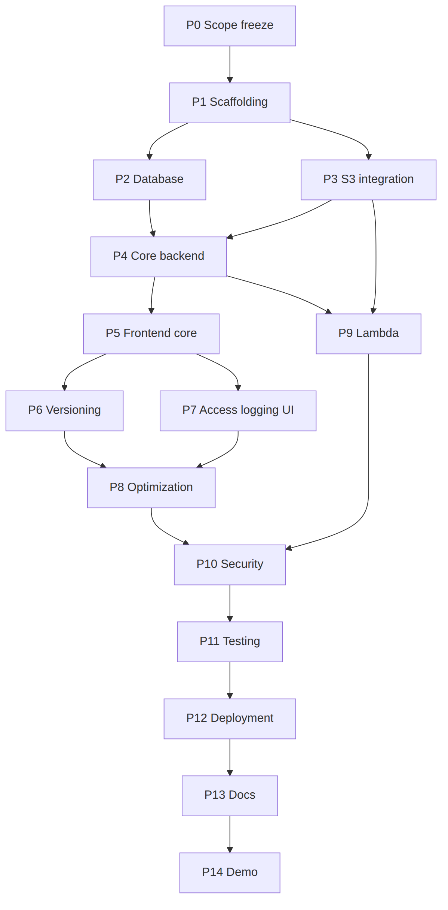

# 12. Repository, Phases and Build Order

## 12.1 Repository structure

> **Amended:** AM-4 and AM-7: no tracked `lib/` folder; `lambda/` and `infrastructure/` are not used; storage lives in `backend/app/storage/`, processing in `backend/app/processing/`. See [doc 15](15-amendments.md).

```text
cloudvault/
├── AGENTS.md
├── README.md
├── CLOUDVAULT_FULL_SPEC.md
├── frontend/                 # React + Vite + Tailwind (src/pages, components, api, hooks)
├── backend/
│   ├── app/
│   │   ├── main.py  config.py  db.py  models.py  schemas.py  security.py
│   │   ├── routers/          # auth, documents, versions, recommendations, dashboard, internal, health
│   │   ├── services/         # s3_service.py, document_service.py, recommendation_engine.py, validation.py
│   │   └── scripts/          # reconcile.py, seed_demo.py
│   ├── alembic/
│   ├── tests/                # unit/, integration/, aws/
│   ├── requirements.txt
│   └── Dockerfile (optional)
├── lambda/
│   ├── handler.py
│   ├── build.sh              # pip install -t build pypdf; zip
│   └── tests/
├── infrastructure/
│   ├── setup_s3.py           # bucket, versioning, BPA, SSE-S3, lifecycle, policy, notification
│   ├── policies/             # backend-iam.json, lambda-role.json, bucket-policy.json
│   └── README.md             # manual steps and teardown
├── docs/                     # this documentation + diagrams/
├── docker-compose.yml        # local Postgres only
├── .env.example
├── .gitignore
└── README.md
```

Single repo, no monorepo tooling. No Terraform: a Python setup script plus JSON policies is enough and easier to explain.

## 12.2 Phases

| Phase | Objective | Key tasks | Depends on | Acceptance |
|---|---|---|---|---|
| 0 | Freeze scope | Confirm this spec; AWS account safeguards (MFA, Budget) | none | Budget alert on |
| 1 | Scaffolding | Repo layout, FastAPI skeleton, Vite app, compose Postgres, config | 0 | `/health` OK; frontend runs |
| 2 | Database | Models, Alembic migration, constraints | 1 | `alembic upgrade head` creates all tables |
| 3 | S3 integration | `setup_s3.py`, `s3_service.py`, startup `HeadBucket` check | 1 | Real bucket private, versioned, lifecycle set |
| 4 | Core backend | Auth, upload, list, download, delete, undelete, permanent delete, access logging | 2, 3 | All core routes pass tests |
| 5 | Frontend core | Login, Documents, Details, Dashboard | 4 | Full flow in browser |
| 6 | Versioning | New version, restore, Versions tab | 4, 5 | Restore creates a new version |
| 7 | Access logging UI | Access tab, dashboard figures | 4 | Access events visible |
| 8 | Optimization | Engine, endpoints, page, seed script | 6, 7 | Apply changes real class |
| 9 | Lambda | Handler, packaging, S3 notification, callback endpoint, retry | 3, 4 | Job reaches `SUCCEEDED` |
| 10 | Security hardening | Rate limits, CORS, headers, validation review | 4 to 9 | Security checklist passes |
| 11 | Testing | Fill gaps, AWS test run | 4 to 10 | Suite green |
| 12 | Deployment | Vercel, Render, Neon, env vars, smoke test | 11 | Public URL works |
| 13 | Documentation | README, architecture, S3-vs-app, viva | 12 | Fresh clone follows README |
| 14 | Demo rehearsal | Seed data, run script twice | 13 | Script runs cleanly end to end |

## 12.3 Dependency graph



Source: [`diagrams/08-dependency-graph.mmd`](diagrams/08-dependency-graph.mmd)

## 12.4 Definition of Done

> **Amended:** AM-7: read "real S3" and "AWS Console" as the simulated store and the in-app Inspector; Lambda items as the worker. See [doc 15](15-amendments.md).

The project is done only when every item is true **and demonstrable**:

- [ ] App runs locally from the README against a real S3 dev bucket.
- [ ] Upload, presigned download, soft delete, undelete and permanent delete work against real S3.
- [ ] Versioning: new version, restore and version list work; the AWS Console shows matching versions and delete markers.
- [ ] Access logging records downloads and appears in the UI.
- [ ] Recommendations generate, can be applied, and the real storage class changes in the Console; the old version is removed.
- [ ] Lambda processing works end to end (event, callback, status in UI).
- [ ] Bucket has Block Public Access on, no CORS, SSE-S3 default, lifecycle rules and bucket policy applied.
- [ ] Security checklist (doc 09 section 9.1) passes; no secrets in Git history.
- [ ] Unit and integration tests pass; the AWS test suite has been run at least once.
- [ ] Deployed frontend, backend and DB work over HTTPS; cold start documented.
- [ ] GitHub repo is clean (no `.env`, no build artifacts); README complete.
- [ ] Demo script has run end to end twice; seed script makes recommendations appear.
- [ ] Everything described in the README or demo is actually implemented.

## 12.5 Build order for a coding agent

> **Amended:** AM-7: T4, T5, T12 and T16 to T19 are redefined for the simulation in `IMPLEMENTATION_PLAN.md`; T17 (Lambda wiring) becomes the processing worker. The AWS steps in T4, T17 and T25 (`-m aws`), and the teardown in T27, are the original specification and are not performed. See [doc 15](15-amendments.md).

Conventions: backend paths are under `backend/app/`, tests under `backend/tests/`. Tasks run strictly in order unless prerequisites say otherwise. Test IDs refer to doc 10.

### T1: Repo scaffold
- **Prereqs:** none
- **Create:** root files, `docker-compose.yml`, `.gitignore`, `.env.example`
- **Requirements:** layout per 12.1; Postgres service in compose; `.gitignore` covers `.env`, `node_modules`, `build/`, `__pycache__`, `*.zip`
- **Validation/acceptance:** `docker compose up` starts Postgres; `.env` is ignored by Git.

### T2: Backend skeleton
- **Prereqs:** T1
- **Create:** `main.py`, `config.py`, `db.py`, `routers/health.py`
- **Requirements:** settings from env (doc 11.4); `/api/health` pings the DB; global exception handler producing the standard error body (doc 05); CORS limited to `FRONTEND_ORIGIN`.
- **Acceptance:** `GET /api/health` returns 200.

### T3: Models and migration
- **Prereqs:** T2
- **Create:** `models.py`, `alembic/`
- **Requirements:** all six tables, indexes, CHECKs, partial unique indexes exactly as doc 04; circular FK via `use_alter`.
- **Validation:** `alembic upgrade head` succeeds on an empty DB; constraint tests (duplicate active name, duplicate open recommendation, duplicate job per version).

### T4: S3 setup script
- **Prereqs:** T1
- **Create:** `infrastructure/setup_s3.py`, `infrastructure/policies/*.json`, `infrastructure/README.md`
- **Requirements:** create bucket (region `ap-south-1`, correct `LocationConstraint`), enable versioning, Block Public Access (all 4), SSE-S3, lifecycle rules (doc 02.2), TLS-deny bucket policy; **idempotent**; prints manual IAM steps. Notification config is added in T17.
- **Acceptance:** re-running is safe; the Console shows all settings.

### T5: S3 service
- **Prereqs:** T2, T4
- **Create:** `services/s3_service.py`
- **Requirements:** boto3 client with SigV4, region, standard retries (3), connect timeout 5 s, read timeout 30 s. Functions: `put_object` (metadata, tags, SHA-256 checksum, returns VersionId), `copy_object` (source VersionId, optional StorageClass), `delete_current` (returns marker VersionId), `delete_version`, `delete_all_versions(key)`, `head`, `get_tags`, `list_versions(prefix)`, `presign_get(key, version_id, filename)`, startup `head_bucket`. Treat a missing `StorageClass` in HEAD as `STANDARD`. Map botocore errors to `STORAGE_ERROR` / `STORAGE_FORBIDDEN`.
- **Tests:** moto tests; `-m aws` A1, A2.

### T6: Validation service
- **Prereqs:** T2
- **Create:** `services/validation.py`
- **Requirements:** `sanitize_filename`, extension allowlist, magic-byte checks, UTF-8/NUL check, size-capped streaming read (413 at limit + 1), SHA-256, extension to content-type map (doc 05.3).
- **Tests:** V1 to V10.

### T7: Auth
- **Prereqs:** T3
- **Create:** `routers/auth.py`, `security.py`
- **Requirements:** bcrypt hashing, JWT (60 min), `get_current_user` dependency, rate limits (login 5/min/IP), generic 401 for bad login.
- **Tests:** S2, S5.

### T8: Document upload and list
- **Prereqs:** T5, T6, T7
- **Create/modify:** `routers/documents.py`, `services/document_service.py`
- **Requirements:** workflow W2; row-lock helper; compensation on failure; name rule + SHA-256 duplicate rule; list/search/filter/sort/pagination (doc 05).
- **Tests:** I1 to I3, C3, A4.

### T9: Download and access log
- **Prereqs:** T8
- **Modify:** `routers/documents.py`
- **Requirements:** W3; presign with VersionId and Content-Disposition; log insert fails closed; 409 and 410 handling.
- **Tests:** I9, S3.

### T10: Delete, undelete, permanent delete
- **Prereqs:** T8
- **Modify:** `routers/documents.py`
- **Requirements:** W4 and doc 02.5 semantics; permanent delete lists all versions and markers and deletes in batches, checks every per-key error, deletes DB rows only after full success.
- **Tests:** I6 to I8, C2.

### T11: Versions and restore
- **Prereqs:** T8
- **Create:** `routers/versions.py`
- **Requirements:** W5 and W6; 410 and `S3_MISSING` on missing S3 version.
- **Tests:** I4, I5, C1.

### T12: S3 Inspector API
- **Prereqs:** T8
- **Modify:** `routers/documents.py`
- **Requirements:** live `HeadObject` + tags; absent storage class means STANDARD; degrade gracefully on 502.
- **Tests:** moto + AWS.

### T13: Recommendation engine
- **Prereqs:** T3
- **Create:** `services/recommendation_engine.py`
- **Requirements:** doc 07 exactly; pure function; thresholds from config; optional `pricing.json` loader returning `null` when absent.
- **Tests:** U1 to U8.

### T14: Recommendation endpoints
- **Prereqs:** T13, T11
- **Create:** `routers/recommendations.py`
- **Requirements:** refresh/list/apply/dismiss; apply = lock, re-evaluate, copy, DB swap, then delete old version.
- **Tests:** I10, I11.

### T15: Dashboard API
- **Prereqs:** T8
- **Create:** `routers/dashboard.py`
- **Requirements:** aggregates per doc 05 (by class, totals, open recs, job counts).
- **Tests:** integration.

### T16: Lambda handler
- **Prereqs:** T5
- **Create:** `lambda/handler.py`, `lambda/build.sh`, `lambda/tests/`
- **Requirements:** doc 08 (decode event, size gate, extractors, callback with token, raise on transient errors, report deterministic failures).
- **Tests:** L1 to L3.

### T17: Lambda wiring
- **Prereqs:** T4, T16
- **Modify/create:** `infrastructure/`
- **Requirements:** deploy function, execution role, resource policy for S3 to invoke, S3 notification (`ObjectCreated:Put`, prefix `documents/`), log retention 7 days.
- **Tests:** A3 (AWS).

### T18: Processing endpoints
- **Prereqs:** T8, T16
- **Create/modify:** `routers/internal.py`, `routers/documents.py`
- **Requirements:** internal callback (token, idempotent, 409 `VERSION_NOT_REGISTERED`), processing status, optional retry via Lambda invoke.
- **Tests:** C4, S4.

### T19: Reconcile and seed scripts
- **Prereqs:** T8, T14
- **Create:** `scripts/reconcile.py`, `scripts/seed_demo.py`
- **Requirements:** reconcile per doc 09.3 with `--fix`; seed uploads real files and backdates `created_at` and access-log rows in the DB only.
- **Validation:** manual run; seed produces recommendations.

### T20: Frontend scaffold
- **Prereqs:** T2
- **Create:** `frontend/`
- **Requirements:** Vite, Tailwind, router, query client, API wrapper, auth context, shell.
- **Acceptance:** builds; login works.

### T21: Frontend core screens
- **Prereqs:** T8 to T10, T15, T20
- **Requirements:** Documents, Details, Dashboard with all states (doc 06).
- **Validation:** manual checklist.

### T22: Frontend versions, inspector, access, processing
- **Prereqs:** T11, T12, T18, T21
- **Requirements:** Restore, Inspector, Access list, Processing tab (+ retry if built).

### T23: Frontend optimization and About
- **Prereqs:** T14, T21
- **Requirements:** table, apply/dismiss dialogs, heuristic disclaimer, S3-vs-app table.

### T24: Security pass
- **Prereqs:** T8 to T18
- **Requirements:** CORS, rate limits, headers, error hygiene, no sensitive logs.
- **Tests:** S1 to S5.

### T25: Test completion
- **Prereqs:** T24
- **Requirements:** fill the doc 10 matrix; run `-m aws` once.
- **Acceptance:** suite green.

### T26: Deployment
- **Prereqs:** T25
- **Requirements:** Render, Vercel, Neon config; env vars; warm-up; smoke test (doc 11.1).
- **Acceptance:** the public flow works.

### T27: Documentation
- **Prereqs:** T26
- **Requirements:** README (setup, architecture, S3-vs-app, teardown), demo and viva sheets finalised.
- **Acceptance:** a fresh-clone walkthrough succeeds.

### T28: Demo rehearsal
- **Prereqs:** T27
- **Requirements:** run reconcile and seed; execute the doc 13 script twice.
